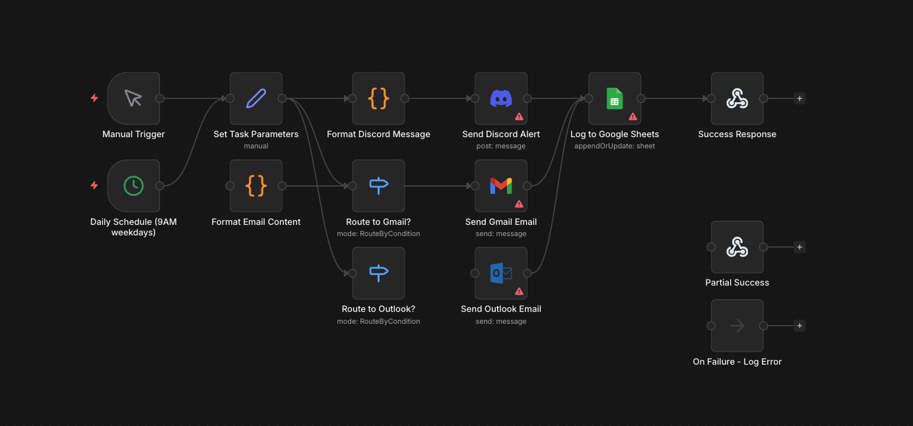

# n8n Manager AI - LangChain Job Automation Workflow

[](LICENSE)
[](manager-workflow.json)

Production-ready **n8n workflow** for AI-powered job task management.
Integrates with LangChain projects to automate Discord alerts, Gmail/Outlook emails, and Google Sheets logging.

## Features

- **Dual Triggers**: Manual testing + Daily schedule (9AM weekdays)
- **Multi-Channel Notifications**: Discord + smart Gmail/Outlook routing  
- **Priority Handling**: High/Medium/Low task prioritization
- **Audit Trail**: Automatic Google Sheets logging
- **Error-Resistant**: Smart routing and fallback paths
- **LangChain Ready**: JSON input/output compatible

## Quick Start

### 1. Import Workflow (30 seconds)

1. Copy manager-workflow.json
2. n8n → Settings → Import from JSON  
3. Paste → Import
4. Configure credentials below


### 2. Required Credentials
| Service | Credential Name | Setup |
|---------|-----------------|--------|
| Discord | `DiscordBot` | Bot token + channel |
| Gmail | `GmailAPI` | OAuth2 |
| Outlook | `OutlookAPI` | Microsoft OAuth2 |
| Google Sheets | `GoogleSheets` | OAuth2 + Sheet access |

### 3. Test Payload
```json
{
  "jobTitle": "Q4 Budget Review Meeting",
  "dueDate": "2024-01-20", 
  "recipientEmail": "john@gmail.com",
  "taskType": "meeting",
  "priority": "high"
}
```

**Execute** Manual Trigger → All channels fire simultaneously.

## Workflow Architecture

```
Manual/Cron Trigger
     ↓
Set Task Parameters  
     ↓
├── Discord Formatter → Discord Alert
├── Gmail Router     → Gmail Email
├── Outlook Router   → Outlook Email
     ↓
Google Sheets Log → Success Response
```

### Node Details

| Node | Purpose | Customization |
|------|---------|---------------|
| `Set Task Parameters` | Normalize LangChain inputs | Default values |
| `Format Discord Message` | Rich Discord formatting | Priority logic |
| `Route to Gmail?` | `@gmail.com` detection | Regex patterns |
| `Route to Outlook?` | `@outlook.com` routing | Regex patterns |
| `Log to Google Sheets` | Audit trail | Replace Sheet ID |

## Configuration

### Google Sheets Setup
1. Create sheet named `Job Tasks`
2. Copy **Sheet ID** from URL: `https://docs.google.com/spreadsheets/d/SHEET_ID/edit`
3. Update `Log to Google Sheets` → `documentId`

### Discord Channel
```
Send Discord Alert → channel: "#job-alerts" (or your channel)
```

### Schedule
```
Daily Schedule → Cron: "0 9 * * 1-5" (9AM Mon-Fri)
```

## Input Schema

| Field | Type | Required | Default | Example |
|-------|------|----------|---------|---------|
| `jobTitle` | string | Yes | "Daily Standup" | "Q4 Review" |
| `dueDate` | string (YYYY-MM-DD) | Yes | Tomorrow | "2024-01-20" |
| `recipientEmail` | string | Yes | "team@company.com" | "john@gmail.com" |
| `taskType` | string | No | "meeting" | "report" |
| `priority` | string | No | "medium" | "high" |

## LangChain Integration

```python
# Example LangChain agent output
payload = {
    "jobTitle": agent_state["task_name"],
    "dueDate": agent_state["deadline"], 
    "recipientEmail": agent_state["assignee"],
    "priority": agent_state["priority"]
}

# POST to n8n webhook URL
requests.post("YOUR_N8N_WEBHOOK_URL", json=payload)
```

## Self-Hosting

```bash
# Docker (recommended)
docker run -it --rm \
  --name n8n \
  -p 5678:5678 \
  -v ~/.n8n:/home/node/.n8n \
  n8nio/n8n

# Import workflow at http://localhost:5678
```

## Troubleshooting

| Issue | Solution |
|-------|----------|
| "Credential not found" | Add OAuth2 credentials |
| Sheets "Permission denied" | Share sheet with service account |
| Discord "Missing Access" | Bot needs `Send Messages` permission |
| Email routing fails | Check regex in Switch nodes |

**Debug**: Enable `On Failure - Log Error` node.

## Development

Fork → Edit `manager-workflow.json` → Test in n8n → PR.

**Node modifications:**
1. Export workflow from n8n
2. Edit JSON parameters 
3. Commit + push

## Screenshot:


## License

MIT License © 2024 Anubhav Karki

Permission is hereby granted, free of charge, to any person obtaining a copy of this software and associated documentation files (the "Software"), to deal in the Software without restriction, including without limitation the rights to use, copy, modify, merge, publish, distribute, sublicense, and/or sell copies of the Software.

## Author

**Anubhav Karki**  
[GitHub](https://github.com/AnubhavKarki) | [n8n-manager-ai](https://github.com/AnubhavKarki/n8n-manager-ai)

---

*Built for LangChain + n8n production automation*
```
